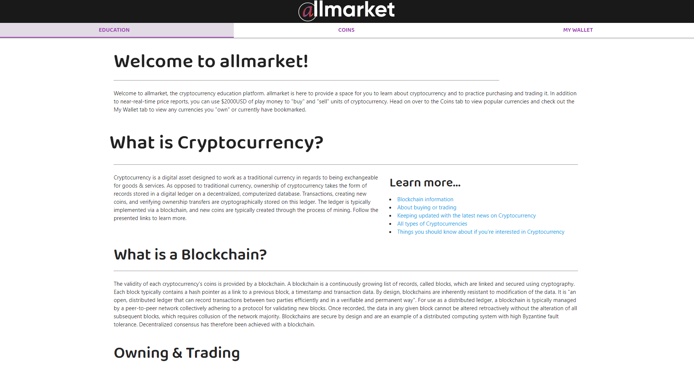
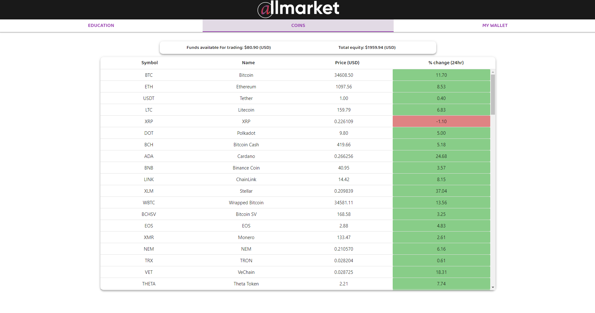
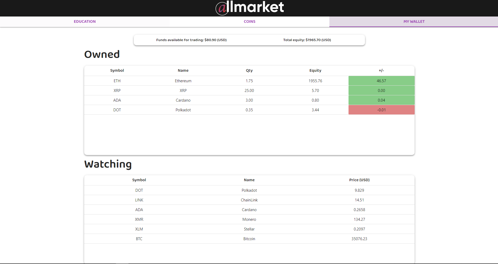
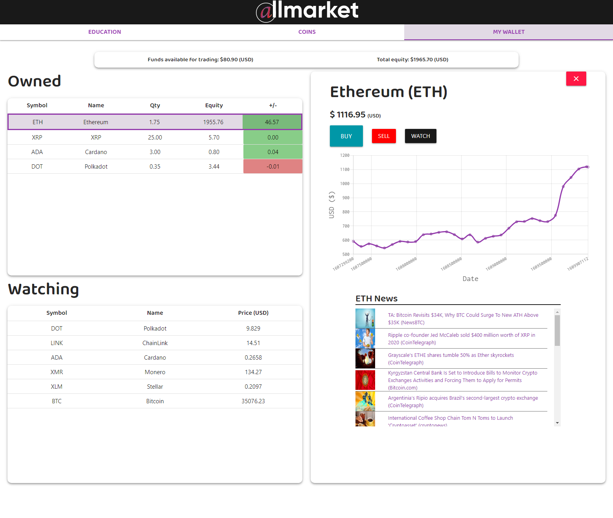

Allmarket is an educational cryptocurrency trading platform where you can:

 - Read and view resources on the basics of cryptocurrency and the basics of trading cryptocurrency.
 - View popular currencies and their current prices.
 - Practice trading cryptocurrency by using $2000 of play money to buy and sell whatever cryptocurrencies you please.

 This application uses the following server side APIs (requests are handled by AJAX):
 - [CoinLore](https://www.coinlore.com/cryptocurrency-data-api)
 - [CryptoCompare](https://min-api.cryptocompare.com/)

 This application also uses [Moment.js](https://momentjs.com/), [Chart.js](https://www.chartjs.org/), and [Materialize](https://materializecss.com/).

 
 
 

 
 
 
